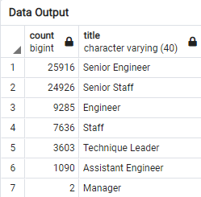
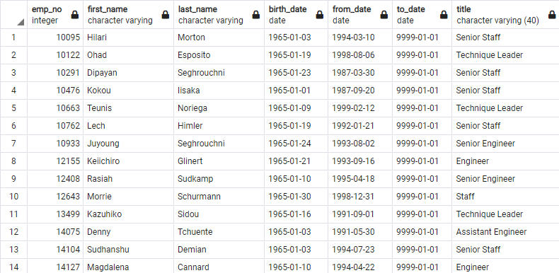

# Pewlett-Hackard-Analysis: Preparing a Mentorship  Program

## Overview

As Hewlett Packard prepares for the retirement of many senior employees (the "silver tsunami") you've asked me to prepare a report using SQL to help guide the creation of a mentorship program for new employees. In this report, I will determine the number of retiing employees per job title, identify employees who are eligibile to participate in a mentorship program.

## Results

### Method
Using SQL, I was able to join and filter tables to provide a list of the the job titles that are set to retire soon. In addition, I was able to provide a list of employees that are set to retire. See examples of data output below: 





### Conclusions
* As you can see from the retiring titles table, a employees from wide set of job titles are set to retire soon. This same wide range can also provide a broad base for the mentorship program.
* Almost 25% of the Hewlett Packard workforce is set to retire soon (72,458 of 300,024). This is a very high ratio of employees and experience that will be leaving the company, and suggests recruitment needs to intensify
* The eligible for mentorship table provides detailed identifying information about each employee which can be used to recruit them into the mentorship program on a volunteer basis
* More than half of the employees eligible for mentorship are senior employees, who should be specifically targeted to act as mentors given their experience. 


## Summary

_How many roles will need to be filled as the "silver tsunami" begins to make an impact?_

Based on the retiring titles table, 72,458 of 300,024 employees are set to retire soon. This is almost 25% of the company, a massive amount a roles. This indicates a serious need for recruitment and mentorship.

These sums can be calculated using the following queries:

```
--Number of Employees
SELECT COUNT(*) emp_no
FROM employees

--Number of Retiring Employees
SELECT SUM(count) 
FROM retiring_titles
```
Are there enough qualified, retirement-ready employees in the departments to mentor the next generation of Pewlett Hackard employees?


