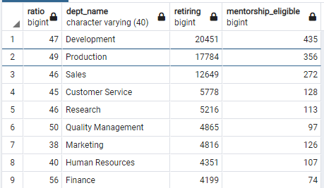

# Pewlett-Hackard-Analysis: The Silver Tsunami and Preparing a Mentorship  Program

## Overview

As Hewlett Packard prepares for the retirement of many senior employees (the "silver tsunami") you've asked me to prepare a report using SQL to help guide the creation of a mentorship program for new employees. In this report, I will determine the number of retiing employees per job title, identify employees who are eligibile to participate in a mentorship program.

## Results

### Method
Using SQL, I was able to join and filter tables to provide a list of the the job titles that are set to retire soon. In addition, I was able to provide a list of employees that are set to retire. See examples of data output below: 


Similarly. I was able to provide a list of younger employees who are eligible for mentorship.


### Conclusions
* As you can see from the retiring titles table, employees from a wide set of job titles are set to retire soon. This same wide range can also provide a broad base for of mentors.
* Almost 25% of the Hewlett Packard workforce is set to retire soon (72,458 of 300,024). This is a very high ratio of employees and experience that will be leaving the company, and suggests recruitment needs to intensify
* The eligible for mentorship table provides detailed identifying information about each employee which can be used to recruit them into the mentorship program, building capacity and sharing the experience of outgoing employees.
* More than half of the employees who are retiring are senior employees, who should be specifically targeted to act as mentors given their experience. 


## Summary

### Roles
_How many roles will need to be filled as the "silver tsunami" begins to make an impact?_

Based on the retiring titles table, 72,458 of 300,024 employees are set to retire soon. This is almost 25% of the company, a massive amount of roles. This indicates a serious need for recruitment and mentorship.

These sums can be calculated using the following queries:

```
--Number of Employees
SELECT COUNT(*) emp_no
FROM employees

--Number of Retiring Employees
SELECT SUM(count) 
FROM retiring_titles
```
### Mentorship Program

_Are there enough qualified, retirement-ready employees in the departments to mentor the next generation of Pewlett Hackard employees?_

As previously noted, more than half of the retiring employees are in senior roles, and the company should leverage this experience and the natural inclination to mentor to maintain the knowledge base of the company. The additional query below breaks down the titles by senior and junior:

```
--Number of Retiring Employees, Senior and Junior
SELECT SUM(Count) 
FROM retiring_titles
GROUP BY title LIKE '%Senior%';
```

I created additional tables, joined them, and created a new ratio calculation to see the breakdown of retiring and mentorship eligible employees by department. The table screen shot is below:


As you can quickly see, more employees are retiring in the Development, Production, and Sales, departments, likely because these departments are the largest in the company. However, overall the ratio of retiring to mentorship eligible employees is relatively constant, with an average of about 45 retiring employees to each mentorship eligible employees.

With minor incentives, it should be possible to pair each mentorship eligible employee with a retiring employee with suitable mentor, especially since more than half of retiring employees are in senior roles. The main outliers are the Human Resources and Marketing Departments, which may need additional attention. 

The SQL query code to produce the table is also included. 



```
-- Get departments for mentorship eligible employees
SELECT me.emp_no,
	me.title,
	de.dept_no,
	dp.dept_name
INTO dept_mentorable
FROM mentorship_eligibility as me
JOIN dept_emp as de
ON me.emp_no = de.emp_no
JOIN departments as dp
ON dp.dept_no = de.dept_no

-- Count Departments for Mentorable Employees
SELECT COUNT(title), dept_name
INTO dept_mentorable_count
FROM dept_mentorable
GROUP BY dept_name
ORDER BY COUNT(*) DESC;

-- Get departments for retiring employees
SELECT ut.emp_no,
	ut.title,
	de.dept_no,
	dp.dept_name
INTO retiring_departments
FROM unique_titles as ut
JOIN dept_emp as de
ON ut.emp_no = de.emp_no
JOIN departments as dp
ON dp.dept_no = de.dept_no

-- Count Departments for Retiring Employees
SELECT COUNT(title), dept_name
FROM retiring_departments
GROUP BY dept_name
ORDER BY COUNT(*) DESC;


-- Copy retiring departments table
CREATE TABLE retiring_departments_count_1 AS 
TABLE retiring_departments_count;

-- Copy dept_mentorable table
CREATE TABLE dept_mentorable_count_1 AS 
TABLE dept_mentorable_count;

-- Rename Columns
ALTER TABLE retiring_departments_count_1 RENAME COLUMN count TO retiring
ALTER TABLE dept_mentorable_count_1 RENAME COLUMN count TO mentorship_eligible

SELECT a.retiring / b.mentorship_eligible as ratio,
a.dept_name,
a.retiring,
b.mentorship_eligible
-- INTO mentorship_ratio
FROM retiring_departments_count_1 as a
JOIN dept_mentorable_count_1 as b
ON a.dept_name = b.dept_name
```


